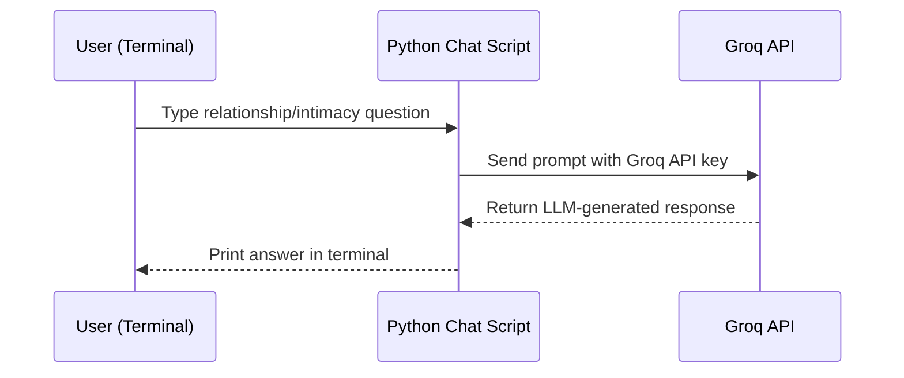

# Groq Relationship & Intimacy Chatbot (Python CLI)

A lightweight **Python CLI chatbot** that uses the **Groq API (free tier)** to answer questions about **love, relationships, and intimacy education** in a safe, informational way.

The project is intentionally simple and focuses on:

- Integrating **Groq LLMs** from Python.
- Building a minimal but practical **chat-style terminal interface**.
- Keeping the code clean and easy to extend into a web app later.

> ⚠️ **Disclaimer**  
> This chatbot is for **educational and informational purposes only**.  
> It is **not** a substitute for professional medical, psychological, or legal advice.  
> Not intended for use by minors.  
> The assistant should respond in a **respectful, non-explicit, and safe** manner.

---

## 📌 Table of Contents

- [Overview](#-overview)
- [Features](#-features)
- [Repository Structure](#-repository-structure)
- [Architecture](#-architecture)
- [Getting Started](#-getting-started)
  - [Prerequisites](#-prerequisites)
  - [Clone the Repository](#-clone-the-repository)
  - [Create Virtual Environment](#-create-virtual-environment)
  - [Install Dependencies](#-install-dependencies)
  - [Set Groq API Key](#-set-groq-api-key)
  - [Run the Chatbot](#-run-the-chatbot)
- [Example Use Cases](#-example-use-cases)
- [Gemini Folder (Not Used)](#-gemini-folder-not-used)
- [Design & Code Highlights](#-design--code-highlights)
- [Future Improvements](#-future-improvements)
- [Author](#-author)

---

## 🧭 Overview

This project is a **terminal-based chatbot** built around the **Groq free API**.  
The main use-case is:

- Ask questions related to:
  - Relationship communication
  - Emotional intimacy
  - Boundaries and respect
  - High-level sexual knowledge and awareness (non-explicit)
- Get answers from an LLM model hosted by **Groq** through a simple Python client.

The goal is to demonstrate:

- How to call **Groq models** from Python.
- How to design a small but clear project structure.
- How to keep the domain focused (relationships & intimacy education).

---

## ✨ Features

- 🔗 **Groq API Integration**
  - Simple Python client that wraps the Groq HTTP API.
  - Uses an environment-based **API key** for authentication.
  - Built for the **free Groq tier**.

- 💬 **CLI Chat Interface**
  - Text-based conversation loop in the terminal.
  - User types a question → chatbot sends it to Groq → prints the response.
  - Easy to debug and extend.

- 🧱 **Separation of Concerns**
  - Groq API client logic in its own module.
  - Chat/demo script separate from the core client.

- 🧪 **Minimal, Focused Domain**
  - Prompts can be guided to keep responses:
    - Educational,
    - Respectful,
    - Non-explicit.

---

## 🗂 Repository Structure

```text
.
├─ groq/
│  ├─ groq_client.py     # Core Groq client (LLM call wrapper)
│  └─ test_groq.py       # Simple CLI chatbot / test script using Groq
│
├─ gemini_api/           # Experimental / unused (requires paid Gemini API)
│  ├─ gemini_client.py   # Gemini client (not used in main chatbot)
│  ├─ list_models.py
│  └─ test_gemini.py
│
└─ .gitignore
```

> ✅ The **main working chatbot** is inside the `groq/` folder.  
> The `gemini_api/` directory is kept for **future experiments** and is **not required** to run this project.

---

## 🏗 Architecture



---

## ⚙ Getting Started

### ✅ Prerequisites

- **Python 3.10+** (or similar)
- A **Groq API key** (free tier is enough)
- `pip` and optionally `venv` for virtual environments

---

### 📥 Clone the Repository

```bash
git clone https://github.com/<your-username>/<your-repo-name>.git
cd <your-repo-name>
```

*(Replace `<your-username>` and `<your-repo-name>` with your actual values.)*

---

### 🧪 Create Virtual Environment

```bash
python -m venv venv
```

**Windows:**

```bash
venv\Scripts\activate
```

**macOS / Linux:**

```bash
source venv/bin/activate
```

---

### 📦 Install Dependencies

If you have a `requirements.txt`:

```bash
pip install -r requirements.txt
```

If not, at minimum you will typically need:

```bash
pip install groq python-dotenv
```

(Adjust based on the imports used in `groq_client.py`.)

---

### 🔐 Set Groq API Key

The recommended way is via **environment variable**.

**macOS / Linux:**

```bash
export GROQ_API_KEY="your-groq-api-key-here"
```

**Windows (PowerShell):**

```powershell
$env:GROQ_API_KEY="your-groq-api-key-here"
```

If your `groq_client.py` uses a `.env` file with `python-dotenv`, you can instead create a `.env` file:

```env
GROQ_API_KEY=your-groq-api-key-here
```

> ⚠️ Never commit your real API key to Git. Add `.env` to `.gitignore`.

---

### ▶ Run the Chatbot

From the project root:

```bash
python groq/test_groq.py
```

Typical flow:

1. The script prompts you to type your question.
2. You enter something like:
   - “How can I build trust in a long-distance relationship?”
   - “What are healthy ways to talk about boundaries with a partner?”
3. The script sends your question to the Groq API.
4. The response is printed back in the terminal.
5. You continue chatting until you exit (e.g., `Ctrl+C` or a custom `exit` command).

---

## 🧩 Example Use Cases

This chatbot is designed for **high-level, non-explicit** topics, such as:

- Communicating clearly in a relationship  
- Respect, consent, and boundaries  
- Emotional intimacy and connection  
- Handling jealousy, misunderstanding, or conflict  
- General sexual health awareness (polite and informational)  

It should **avoid graphic or explicit content** and remain educational.

---

## 📁 Gemini Folder (Not Used)

The repository also contains a `gemini_api/` directory. This was created for **experimentation**, but:

- Gemini currently requires **paid / billable API usage**.
- The main chatbot does **not** depend on these files.
- You can safely ignore this folder unless you want to:
  - Add another LLM provider later,
  - Or show that you experimented with multi-provider support.

For now, the **only required and working integration** is **Groq**.

---

## 🧠 Design & Code Highlights

- **Simple, Reusable Groq Client**
  - Encapsulates API calls in `groq_client.py`.
  - Easy to plug into other interfaces (web app, bot, etc.).

- **Clean Separation**
  - `test_groq.py` is responsible only for:
    - CLI loop,
    - Calling the client,
    - Printing responses.

- **Easy to Extend**
  - You can add:
    - Conversation memory,
    - System prompts for safer behavior,
    - Different models or temperature settings.

---

## 🚧 Future Improvements

Some planned / possible enhancements:

- 🌐 Wrap the chatbot in a **Flask/FastAPI** web interface.
- 💾 Maintain **conversation history** and context for better replies.
- 🛡 Add stronger **safety filters** and content moderation.
- 🧱 Support multiple LLM providers (Groq + Gemini + others, if cost allows).
- 🐳 Add a simple **Dockerfile** for containerized deployment.

These points show how the small CLI project can grow into a more production-like service.

---

## 👤 Author

**Abdullah Al Noman** 
